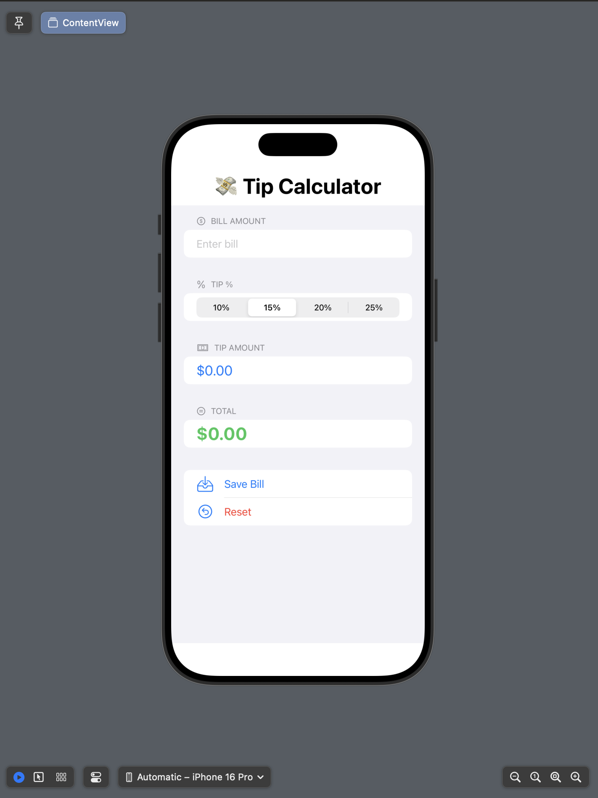
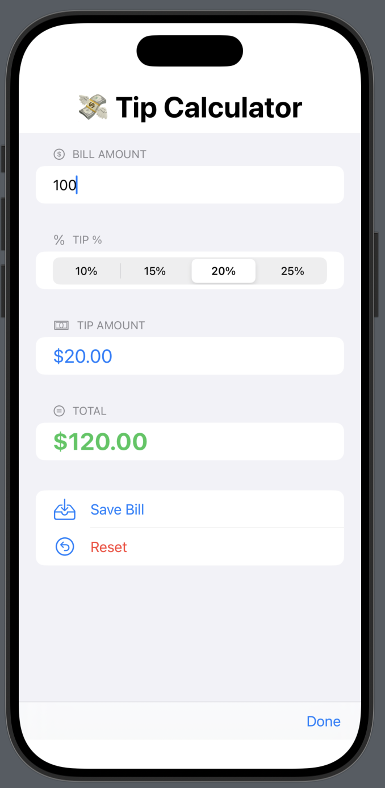
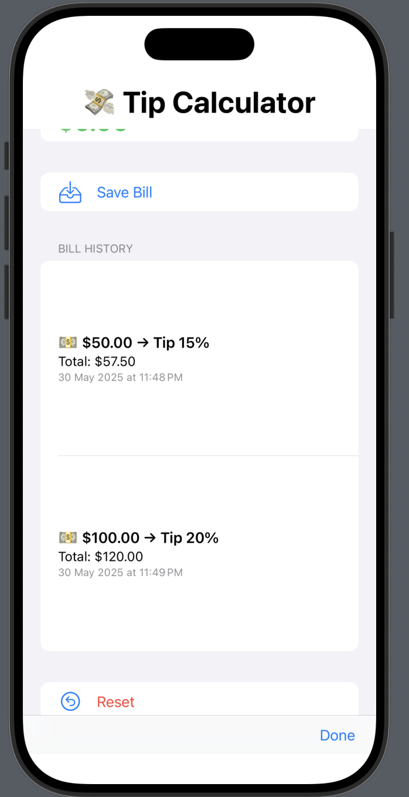

# 💸 TipCalculator – iOS SwiftUI App

An elegant SwiftUI app to calculate tips and save bill history. Designed to demonstrate iOS development using Apple's native frameworks.

## 🚀 Features
- Bill input and tip % selection
- Real-time tip and total calculation
- Persistent bill history using `UserDefaults`
- Swipe-to-delete and reset functionality
- Responsive SwiftUI layout

## 📱 Screenshot
_Add screenshot here once added to `screenshots/` folder_

## 🛠 Tech Stack
- Swift
- SwiftUI
- Xcode
- UserDefaults

## 👨‍💻 Author
Rohith Y V – [github.com/rohithyv](https://github.com/rohithyv)

## 📱 App Screenshots

### 🧮 Basic UI - Initial State

### 💵 Example - $50 with 15% Tip

### 💰 Example - $100 with 20% Tip

### 📜 Saved History View

# TipCalculator
